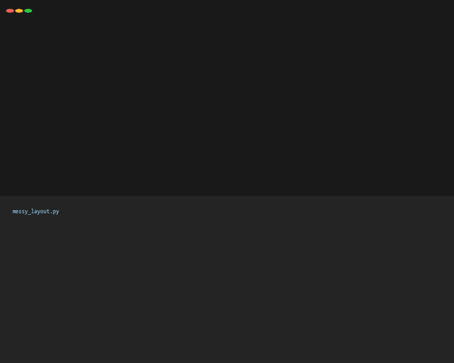

<div align="center">


# mpltweak

**Lay out matplotlib like a slide deck — then write it back into your code.**

[](https://pypi.org/project/mpltweak/)
[](LICENSE)
[]()

`pip install mpltweak` · matplotlib only (a Qt or Tk backend is needed for the window)

**English** · [中文](README.md)

</div>

---

## Layout is something you see, not something you guess

Drag, align, snap — put the panels where they belong, on the real figure. Close the window and
the numbers land in `.tweak_params/`.

One `mpltweak apply --write` finds those exact numbers via the AST and **rewrites them in place** —
no scaffolding inserted. Backup, headless re-run, semantic comparison: if any step fails it rolls
back. **It never leaves a broken script behind.**

No imports, no hooks, no residue. Your source code never knows it was there.

```
              ┌────────────────────────┐
              │        fig1.py         │   plain matplotlib
              │  fig.add_axes([...])   │   untouched
              └───────────┬────────────┘
                          │  mpltweak fig1.py
                          ▼
              ┌────────────────────────┐
              │      live window       │   drag · align · snap · font size
              │                        │   in-memory only
              └───────────┬────────────┘
                          │  close the window
                          ▼
              ┌────────────────────────┐
              │  .tweak_params/        │   params saved silently (public JSON spec)
              │      fig1.json         │   not a single character of code changed
              └───────────┬────────────┘
                          │  mpltweak apply fig1.py --write
                          ▼
              ┌────────────────────────┐
              │  AST lookup → rewrite  │   only the numbers already in your code
              └───────────┬────────────┘
                          │  three-layer verification
              ┌───────────┴────────────┐
              ▼                        ▼
     ┌──────────────────┐     ┌──────────────────┐
     │      passed       │     │      failed       │
     │  commit + backup  │     │   auto rollback   │
     └──────────────────┘     └──────────────────┘
```

The last step looks like this (real output, real diff):



---

## Demos

<table>
<tr>
<td width="50%"><br>
<b>Drag + edge snapping</b><br>Ghost preview and alignment guides while dragging; it clicks into place near a target</td>
<td width="50%"><br>
<b>Align / distribute</b><br>Ctrl-select three panels → one keystroke to left-align and distribute evenly</td>
</tr>
<tr>
<td><br>
<b>Hover to resize text</b><br>Hover a title, axis label, tick label or legend and press <code>+</code> / <code>-</code></td>
<td><br>
<b>Wireframe mode (space)</b><br>Full cartopy redraw <b>494ms → 169ms</b> — layout stops stuttering</td>
</tr>
</table>

---

## Install

```bash
pip install mpltweak            # core (write-back / doctor, no window needed)
pip install "mpltweak[qt]"      # with the PyQt5 window (recommended on Windows / Linux)
```

Check your environment:

```bash
mpltweak doctor     # Python / matplotlib version, available backends, fonts
```

> `matplotlib.use('Agg')` in your script (common in batch plotting) **does not need changing** —
> the launcher takes over the backend temporarily and `savefig` output stays identical.

---

## Keys

| Action | Effect |
|---|---|
| Drag a panel / drag an edge or corner | Move / PowerPoint-style resize (opposite edge pinned; aspect-locked axes scale uniformly) |
| **Ctrl+click** (or Shift+click) | Add / remove from selection; drag on empty space for rubber-band select |
| **Ctrl+Shift+L/R/T/B/C/M** | Align left / right / top / bottom / centre horizontally / centre vertically |
| **Ctrl+Shift+H / V** | Distribute horizontally / vertically (ends fixed, equal gaps) |
| **Ctrl+Z** / **Ctrl+Y** (or Ctrl+Shift+Z) | Undo / redo |
| Hover text, then `+` / `-` | Font size of title, axis label, ticks, legend, colorbar |
| **Space** | Wireframe mode (borders and text only, data artists hidden) |
| **Ctrl+F** | Fit the canvas to its content (trim the white margin; panels keep their pixel size) |
| **Arrow keys** / Shift+arrows | Move the panel (PPT muscle memory) / fine-tune size around its centre |
| Drag a colorbar's long edge / thin side / middle | Length / thickness / move the whole bar |
| Drag the legend | Preview of 8 standard spots, snaps on release |
| `[` `]` · `c` · `C` · `g` · `s` · `x` `y` | Line width / line colour / colormap / grid / spines / linear-log axes |
| `n` · `e` · `?` | Snapping toggle / manual export / help |
| Drag the window edge | Change the canvas size (written back as `figsize`) |

---

## Three-layer verification

`--write` never edits blindly, and every step is reversible:

1. **It runs** — the script is re-run headlessly with Agg; a non-zero exit rolls back immediately.
2. **It did the right thing** — the target figure's state is dumped and compared field by field
   against the params (position / font size / grid / spines / clim). "Runs, but the layout never
   reached the target figure" counts as a failure.
3. **Retry with another anchor** — the `savefig` matching that figure index → main anchor → end of
   script; only when all of them fail does it roll back.

The backup lives in `.tweak_params/<script>.tweak.bak` (never scattered into your source tree),
and a slow script that times out is not treated as a failure — you are simply told to confirm.

---

## `.tweak_params/*.json` spec (version 3)

The params file is a **public format** — edit it by hand, or let an AI / agent generate it, and
`--write` will still apply it:

```jsonc
{
  "version": 3,
  "script": "fig1.py",
  "figsize_px": [1500, 700],             // canvas in logical pixels (null if never resized)
  "figsize_in": [15.0, 7.0],             // inches written back to figsize
  "axes": [
    {
      "index": 0,                        // = order in fig.axes
      "pos": [0.048, 0.655, 0.30, 0.215],  // [x0, y0, w, h], figure-normalised
      "aspect_locked": false,
      "title_fontsize": 9.0,
      "label_fontsize": 8.0,
      "tick_fontsize": 8.0,
      "grid": false,
      "spines": { "top": false, "right": false },
      "xscale": "linear",
      "yscale": "linear",
      "is_colorbar": false,
      "clim": [-2.0, 2.0],
      "cmap": "RdBu_r",
      "lines": [ { "index": 0, "linewidth": 1.2, "color": "#0F4D92" } ],
      "legend": { "loc": "upper right", "fontsize": 8.0 }
    }
  ]
}
```

---

## Development

```bash
git clone https://github.com/shdbl/mpltweak && cd mpltweak
pip install -e .
python tests/test_tweak.py       # interactive core
python tests/test_events.py      # event paths
python tests/test_redo.py        # undo / redo
python tests/test_writeback.py   # AST write-back + three-layer verification
python tools/crosscheck.py       # environment / API compatibility check
```

```
src/mpltweak/
├── cli.py          # mpltweak <script> | apply | doctor
├── launch.py       # run the script → attach windows → save params on close
├── toolbox.py      # interactive core (the Tweak controller, pure matplotlib events)
├── params.py       # params JSON spec (version 3)
├── apply.py        # change list / write-back entry point
├── writeback.py    # AST lookup + in-place / block write-back
└── verify.py       # semantic verification (re-run, compare field by field)
```

`toolbox.py` also works as an **embedded API** (`from mpltweak.toolbox import gaitu`),
but the CLI is the intended interface — your scripts should never mention this tool.

## License

MIT
