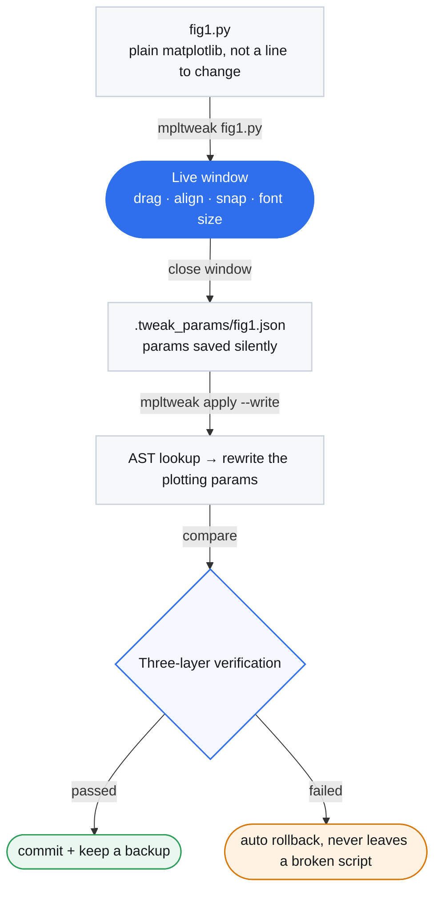

<div align="center">


# mpltweak

**Lay out matplotlib like a slide deck — then write the numbers back into your code.**

[](https://pypi.org/project/mpltweak/)
[](https://pypi.org/project/mpltweak/)
[](LICENSE)
[](https://github.com/shdbl/mpltweak/actions/workflows/tests.yml)

[中文](https://github.com/shdbl/mpltweak/blob/main/README.md) | **English**

</div>

## Contents

- [What it solves](#what-it-solves)
- [Demos](#demos)
- [What it actually changes](#what-it-actually-changes)
- [Install](#install)
- [Quick start](#quick-start)
- [Keys](#keys)
- [Workflow](#workflow)
- [Three-layer verification](#three-layer-verification)
- [Params file](#params-file)
- [A layout interface for AI agents](#a-layout-interface-for-ai-agents)
- [Splitting the work: human + agent](#splitting-the-work-human--agent)
- [Development](#development)

## What it solves

mpltweak is an **interactive layout editor for matplotlib multi-panel figures**. Laying those out
is fiddly: nudge one panel and the axis label next to it gets covered; enlarge the fonts and the
legend lands on a curve. And every change costs another re-run and another look at the output.

**If placing those panels were as direct as arranging pictures on a slide, the numbers would not
need all that editing — that is what mpltweak does.**

| Way | Process |
|---|---|
| **The old way** | edit a number → re-run the script → wait → look at the PNG → still wrong → edit again |
| **mpltweak** | open the window → drag it into place → `mpltweak apply --write` → the numbers are back in your code |

**Core feature: deterministic source rewriting.** AST-based precise targeting, in two modes: **when the code holds literal numbers, it edits exactly those numbers** (cleanest — nothing is inserted); **otherwise it inserts one self-contained adjustment block** (no imports, no change to your logic). Both modes come with built-in three-layer verification (runs / rewrote correctly / retry with fallback anchor), auto-rollback on any failure — **it will never leave a broken script behind**.

**Precisely because we do modify source, we must be deterministic** — that is the premise mpltweak is built on.

**It only touches style and position — it never invents content.** Text, data and artists stay
exactly what your code says.

## Demos

<table>
<tr>
<td width="50%"><br>
<b>Drag + edge snapping</b><br><sub>Ghost preview and alignment guides while dragging; it clicks into place near a target</sub></td>
<td width="50%"><br>
<b>Align / distribute</b><br><sub>Ctrl-select three panels → one keystroke to left-align and distribute evenly</sub></td>
</tr>
<tr>
<td><br>
<b>Hover to resize text</b><br><sub>Hover a title, axis label, tick label or legend and press <code>+</code> / <code>-</code></sub></td>
<td><br>
<b>Wireframe mode (space)</b><br><sub>Full cartopy redraw <b>494ms → 169ms</b> — dragging stops stuttering</sub></td>
</tr>
</table>

**Full PPT-style gesture set:** Drag panels, Ctrl multi-select, align/distribute (Ctrl+Shift+L/R/T/B/C/M, H/V), edge snapping (with guides), Ctrl+F fit canvas to trim margins, space for wireframe mode, hover to resize text, legend snapping to 8 standard spots, colorbar length/thickness adjustment.

**Deep research-scenario support:** cartopy maps, colorbar (position/clim/cmap), multi-mappable precise pairing (by receiver variable name / explicit parent axis in `fig.colorbar(cs, ax=ax1)`), `matplotlib.use('Agg')` scripts work as-is.

## What it actually changes

Take `fig1.py`. **Before** (hand-written numbers, rarely even):

```python
ax1 = fig.add_axes([0.08, 0.66, 0.30, 0.21])
ax2 = fig.add_axes([0.11, 0.38, 0.30, 0.21])
ax3 = fig.add_axes([0.05, 0.08, 0.30, 0.21])
```

**After** (what `mpltweak apply --write` leaves behind):

```diff
-ax1 = fig.add_axes([0.08, 0.66, 0.30, 0.21])
+ax1 = fig.add_axes([0.08, 0.655, 0.300, 0.215])
-ax2 = fig.add_axes([0.11, 0.38, 0.30, 0.21])
+ax2 = fig.add_axes([0.08, 0.380, 0.300, 0.215])
-ax3 = fig.add_axes([0.05, 0.08, 0.30, 0.21])
+ax3 = fig.add_axes([0.08, 0.085, 0.300, 0.215])
```

**This is the first case: the code held literal numbers, so only those numbers moved** — no new lines, no `import`, no dependency introduced.
Font sizes, legend placement, grid and colorbar work the same way — it rewrites parameters that were **already in your code**.

When positions are computed by `plt.subplots()` / `plt.subplot(1,2,n)` / `GridSpec`, **there is no number in the source to edit** — which is common in real scripts. Those figures get a **self-contained adjustment block** instead:

```python
# ===== 自动布局调整（由调图工具生成，勿手改；重复写回会整体替换）=====
# 本块由 mpltweak 自动生成于 2026-10-10 10:15（可手动微调，勿删上下两行标记）
for _ax, _p in zip(fig.axes, [
    [0.0480, 0.6550, 0.3000, 0.2150],
    [0.0480, 0.3700, 0.3000, 0.2150],
    [0.0480, 0.0850, 0.3000, 0.2150],
    [0.4550, 0.5600, 0.4300, 0.3100],
]):
    _ax.set_position(_p)
# ===== 自动布局调整结束 =====
```

The block is **self-contained**: no `import`, nothing beyond matplotlib, no change to your logic. Re-writing replaces it wholesale rather than piling up. Both modes have three-layer verification + automatic rollback.

That is the payoff of deterministic rewriting: mpltweak uses AST-based precise targeting + three-layer verification — **making layout results truly land in your code, not just live inside a tool**.

## When not to use it

Write-back verification **re-runs your whole script on your machine, in your environment** — that is part of
the mechanism, not an optional step (`--no-verify` can skip it, but that turns off the only safety net).
So these scripts are out of scope:

| Script trait | Why |
|---|---|
| A single run takes minutes or more | Every write-back re-runs it; `--timeout 600` widens the wait, it does not remove it |
| Loads big data / heavy deps / needs network or credentials | The headless re-run stalls or fails |
| Needs human input midway (`input()`, interactive choices) | The headless re-run simply blocks |
| Only meaningful under a specific interactive backend | Verification always uses the headless Agg backend |

For those, stay on the read-only path (`mpltweak describe` / `mpltweak check`, neither writes back),
or edit the code by hand. The target user is **small-to-medium plotting scripts that run locally**.

## Install

Every command below runs in a **shell** — cmd / PowerShell on Windows, Terminal on macOS / Linux,
or the **Terminal** pane at the bottom of PyCharm (**not** the Python Console / interactive
interpreter). `cd` into your script's folder before tuning.

```bash
pip install mpltweak
```

## Quick start

### 1 · Your existing script, not a line to change

```python
# fig1.py — just plain matplotlib
import matplotlib.pyplot as plt
import numpy as np

fig = plt.figure(figsize=(10, 8))
x = np.linspace(0, 1, 200)

ax1 = fig.add_axes([0.08, 0.66, 0.30, 0.21])      # the layout is these numbers
ax1.plot(x, np.sin(6 * x))
ax1.set_title('(a)')

ax2 = fig.add_axes([0.11, 0.38, 0.30, 0.21])      # hand-written numbers are rarely even
ax2.scatter(np.random.rand(60), np.random.rand(60), s=8)

ax3 = fig.add_axes([0.05, 0.08, 0.30, 0.21])
ax3.hist(np.random.randn(300), bins=20)

fig.savefig('fig1.png', dpi=150)
```

No `import mpltweak`, no hooks, no decorators.

### 2 · Open the tuning window

```bash
mpltweak fig1.py
```

In the window: **drag** a panel to move it, drag an **edge / corner** to resize,
**Ctrl+click** to multi-select → `Ctrl+Shift+L` to left-align / `Ctrl+Shift+V` to distribute,
**hover text** and press `+` / `-` to resize it, **space** for wireframe mode (fast on heavy
figures), **Ctrl+F** to trim the white margin. Press **`?`** any time for the key cheat-sheet.

**Close the window when you are done.** Not a single character of your script has changed —
the params are sitting in `.tweak_params/fig1.json`.

### 3 · See what it intends to change (read-only)

```bash
mpltweak apply fig1.py
```

Prints the position and font-size list for every axis. Writes nothing.

### 4 · Write it back

```bash
mpltweak apply fig1.py --write
```

```text
✓ 已原位写回: fig1.py
  原位修改 4 处: ax0.pos, ax1.pos, ax2.pos, ax3.pos
  备份: .tweak_params/fig1.tweak.bak
  ✓ Agg 重跑验证通过
  ✓ 语义验证通过（目标图状态 == 参数）
```

It only rewrites the numbers inside your `add_axes([...])` calls; if any verification step
fails, it rolls back.

### 5 · Re-run and look

```bash
python fig1.py
```

### Common cases

| Symptom | What to do |
|---|---|
| No window | Run `mpltweak doctor` for a diagnosis |
| Want to start over | Delete `.tweak_params/fig1.json` (keep it and you continue from last time) |
| Multi-figure script | Every figure gets a window, **whichever you edit is recorded**; `apply` writes each back |
| Script loads data / runs long | Try `--timeout 600` first to **widen** the wait. `--no-verify` **skips the re-run check entirely** — that check is the only automatic safety net against writing broken code, so use it only when the script truly cannot be re-run headlessly, and only after committing it to version control |
| **Dragging feels laggy** | Press **space** for wireframe mode: only borders, axes and text are drawn, **no data artists** (measured on a cartopy map: 494ms → 169ms). Press space again to restore |
| You edited the code by hand, then reopened | It will **refuse to re-apply** the old params (so your edits are not silently overwritten) and tell you why; add `--force-resume` to resume anyway |
| The script enables `constrained_layout` / `autolayout` | You get a warning (with the **line number**) when opening the window and when writing back: the layout engine recomputes axes positions on every draw, so dragged/written-back positions get overridden. Turn it off before tweaking (or position the axes you care about with `add_axes([...])` — the engine does not manage those) |

## In-place numbers vs. an inserted block

`apply --write` defaults to `--style auto`: **each figure decides for itself**.

| Case | Result |
|---|---|
| The code has editable literals (`add_axes([...])`, `set_title/set_xlabel(fontsize=)`, `tick_params(labelsize=)`, `grid(...)`) | **The numbers are edited in place**; your script's style is untouched |
| Not a single field can be matched (typically axes created by `plt.subplots()` / `GridSpec`) | That figure **falls back to an inserted block** |
| Some fields match, some do not (`clim` / `cmap` / `legend` / `spines`, grid-axis positions, colorbar host position) | **Stays in place**; the unmatched fields are **listed one by one** under "not applied in place" (never dropped silently) — use `--style block` if you want them unified |

Force one mode: `--style inplace` (never insert a block; unmatched stays untouched) or
`--style block` (always a block).

**A file can end up mixed across runs**: numbers edited in place first, then a later run fell back to a
block. Both are valid, but readers of the code get confused. To truly unify, restore from the backup first
(`.tweak_params/<script>.tweak.bak` is the pre-write-back source), then write once with `--style block` —
blocks are replaced wholesale, but a second write-back alone will not undo numbers edited earlier.

## Keys

| Action | Effect |
|---|---|
| **`?`** | **Open / close the key cheat-sheet** (in-canvas overlay: Esc closes, L switches language) |
| Drag a panel / drag an edge or corner | Move / PowerPoint-style resize (opposite edge pinned; aspect-locked axes scale uniformly) |
| **Ctrl+click** (or Shift+click) | Add / remove from selection; drag on empty space for rubber-band select |
| **Ctrl+Shift+L/R/T/B/C/M** | Align left / right / top / bottom / centre horizontally / centre vertically |
| **Ctrl+Shift+H / V** | Distribute horizontally / vertically (ends fixed, equal gaps) |
| **Ctrl+Z** / **Ctrl+Y** (or Ctrl+Shift+Z) | Undo / redo |
| Hover text, then `+` / `-` | Font size of title, axis label, ticks, legend, colorbar |
| **Space** | Wireframe mode (borders and text only, data artists hidden) |
| **Ctrl+F** | Fit the canvas to its content (trim the white margin; panels keep their pixel size) |
| **Arrow keys** / Shift+arrows | Move the panel (PPT muscle memory) / fine-tune size around its centre |
| Drag a colorbar's long edge / thin side / middle | Length / thickness / move the whole bar |
| Drag the legend | Preview of 8 standard spots, snaps on release |
| `[` `]` · `c` · `C` · `g` · `s` · `x` `y` | Line width / line colour / colormap / grid / spines / linear-log axes |
| `n` · `e` | Snapping toggle / manual export |
| Drag the window edge | Change the canvas size (written back as `figsize`) |

## Workflow



From opening the window to `mpltweak apply --write`, not a single character of your script changes
at any point (including after you close it) — the write-back only happens when you explicitly ask
for it in step three.

## Three-layer verification

`--write` never edits blindly, and every step is reversible:

1. **It runs** — the script is re-run headlessly with Agg; a non-zero exit rolls back immediately.
2. **It did the right thing** — the target figure's state is dumped and compared field by field
   against the params (position / font size / grid / spines / clim). "Runs, but the layout never
   reached the target figure" counts as a failure.
3. **Retry with another anchor** — the `savefig` matching that figure index → main anchor → end of
   script; only when all of them fail does it roll back.

**This is the safety net for deterministic rewriting.** The backup lives in `.tweak_params/<script>.tweak.bak` (never scattered into your source tree),
and a slow script that times out is not treated as a failure — you are simply told to confirm.

### Changed your mind: `mpltweak revert`

Wrong write-back, or the previous version actually looked better? No need to dig for the backup:

```bash
mpltweak revert fig1.py            # preview only: which lines come back (the default; touches nothing)
mpltweak revert fig1.py --write    # actually go back to "before the last write-back"
```

It uses the same `.tweak_params/<script>.tweak.bak` file that every `apply --write` leaves behind.
**Revert is itself reversible**: the current version is saved as `<script>.revert.bak` first, so a
slip can be undone. The restore copies **bytes verbatim** (BOM / line endings / encoding untouched).

### Slow scripts: `--verify-fast`

If the script takes minutes and you just want to see the result:

```bash
mpltweak apply fig1.py --write --verify-fast
```

**What it guarantees**: the source is still valid Python (a broken edit is rolled back on the spot,
so you never end up with a script that refuses to run).

**What it does not guarantee** (important): **the script is not re-run** — it does not prove the
script runs, nor that the layout actually landed on the target figure. Use it for the fast
iterate-and-look loop, and drop the flag for the real thing. `--json` reports
`"verify_mode": "fast"` and `"verified": null`, so an agent can tell the result was never re-run.

### In CI: `--strict`

By default `check` reports layout-engine conflicts (`constrained_layout` / `autolayout`) as
**advisory** — that is normal matplotlib. If your project wants to forbid layouts the engine will
override, `--strict` turns them into **problems** (exit code 1):

```bash
mpltweak check fig1.py --strict            # layout-engine conflict -> rc=1
mpltweak apply fig1.py --write --strict    # refuses to write back (override with --allow-layout-conflict)
```

`check --json` is a natural CI gate (the `ok` field plus the exit code).

## Params file

The params file is a **public format** — edit it by hand, or let an AI / agent generate it, and
`--write` will still apply it. The top-level `version` field marks the format revision (currently 4;
older files still load) so the tool can tell how to read older files:

```jsonc
{
  "version": 4,
  "script": "fig1.py",
  "figsize_px": [1500, 700],             // canvas in logical pixels (null if never resized)
  "figsize_in": [15.0, 7.0],             // inches written back to figsize
  "axes": [
    {
      "index": 0,                        // = order in fig.axes
      "pos": [0.048, 0.655, 0.30, 0.215],  // [x0, y0, w, h], figure-normalised
      "aspect_locked": false,
      "title_fontsize": 9.0,
      "label_fontsize": 8.0,
      "tick_fontsize": 8.0,
      "grid": false,
      "spines": { "top": false, "right": false },
      "xscale": "linear",
      "yscale": "linear",
      "is_colorbar": false,
      "clim": [-2.0, 2.0],
      "cmap": "RdBu_r",
      "xlim": [-0.01, 1.01],             // axis limits: recorded only when the script fixes them (never for autoscale)
      "ylim": [0.0, 10.0],
      "cell": [1, 2, 0, 1],              // grid identity [nrows, ncols, row, col] (null for hand-placed add_axes)
      "lines": [ { "index": 0, "linewidth": 1.2, "color": "#0F4D92" } ],
      "legend": { "loc": "upper right", "fontsize": 8.0 }
    }
  ]
}
```

## A layout interface for AI agents

An LLM can write correct plotting code, but **the layout numbers are guesswork** — it cannot see
the figure.

mpltweak turns that guesswork into a file write:

**The params file is public JSON format (with JSON Schema).** AI can generate or edit it directly, without "seeing" the figure. `mpltweak apply --write` commits it to your source **deterministically**: AST lookup + three-layer verification + rollback on failure — **a bad guess can't corrupt your script**.

**Core idea: let the AI own the content; let mpltweak own the layout.**

```jsonc
// the agent produces this → mpltweak apply fig1.py --write → it lands in your source
{ "axes": [
  { "index": 0, "pos": [0.080, 0.560, 0.395, 0.330],
    "title_fontsize": 9.5, "legend": { "loc": "upper right" } },
  { "index": 1, "pos": [0.525, 0.560, 0.395, 0.330],
    "title_fontsize": 9.5, "legend": { "loc": "upper right" } }
] }
```

**Full read → edit → write → check loop:**

| Command | What it does |
|---|---|
| `mpltweak describe <script>` | Export the **current layout** as params JSON, no window (the agent's "read") |
| `mpltweak schema` | Print the params JSON Schema so an agent can validate what it produced |
| `mpltweak apply <script> --write --json` | Commit it back to source and emit machine-readable results (`--json` sends all chatter to stderr) |
| `mpltweak revert <script> [--write]` | Go back to before the last write-back (preview by default; the current version is kept as well) |
| `mpltweak check <script> --json` | Check without seeing the figure: alignment / size / gaps / fonts / overflow / overlap, plus **text measured at its real rendered size** (out of canvas = problem, texts colliding = advisory) and inconsistent axis limits; layout-engine conflicts get their own column (`--strict` promotes them to problems) |

```bash
mpltweak describe fig1.py -o layout.json    # read: the layout as it is now
# ...the agent edits a few numbers in layout.json...
mpltweak apply fig1.py --write --json       # write: back into source, self-checked
mpltweak check fig1.py --json               # check: layout health report in JSON
```

**Why "read" is needed**: for explicit `add_axes([...])` you can just read the source. But a
`plt.subplots()` grid, the effective default when no `fontsize=` is written, the positions after
`tight_layout()`, and the true sizes of colorbars and aspect-locked (cartopy) axes — **those numbers
do not exist in the source**; you have to run it once.

### Also usable from AI clients (MCP)

MCP is an optional extra. With it installed you can attach mpltweak to Claude Desktop / Cursor /
Claude Code and let the AI call it directly, instead of shelling out:

```bash
pip install "mpltweak[mcp]"
mpltweak mcp                    # start the stdio server
```

Then add this to the client config:

```json
{"mcpServers": {"mpltweak": {"command": "mpltweak", "args": ["mcp"]}}}
```

Four tools map to the four commands above: `describe_layout` / `check_layout` / `params_schema` /
`apply_layout` (read-only preview unless `write=true`).

### Let your AI read the manual (skill)

`skills/mpltweak/SKILL.md` in this repo is an **operating manual written for AI assistants**
(Agent Skills format): the full command set, the ground rules, and the human/agent workflows.
Feed it to your assistant and it will know how to drive mpltweak — no repeated explaining.

## Splitting the work: human + agent

| Division | How |
|---|---|
| **Human drags → agent commits** | You finish dragging, say the word, the agent runs `apply --write` |
| **Agent drafts → human fine-tunes** | The agent lays it out by rule first → you keep tweaking in the window (params resume) → commit |
| **Agent self-check** | After plotting, the agent runs `check`: uneven/unaligned/mismatched/overflow/overlap, without seeing the figure |
| **One figure as a template** | `describe` the good one → change its `script` field → `apply` it to the others, for a consistent paper |
| **Human drags → agent summarises** | The agent reads the params JSON and explains the change in plain words (good for commit messages or captions) |

The rule of thumb: **taste belongs to you, precision belongs to the agent.**

## Development

```bash
git clone https://github.com/shdbl/mpltweak && cd mpltweak
pip install -e .
python tests/test_tweak.py       # interactive core
python tests/test_events.py      # event paths
python tests/test_redo.py        # undo / redo
python tests/test_writeback.py   # AST write-back + three-layer verification
python tools/crosscheck.py       # environment / API compatibility check
```

```text
src/mpltweak/
├── cli.py          # mpltweak <script> | apply | doctor
├── launch.py       # run the script → attach windows → save params on close
├── toolbox.py      # interactive core (the Tweak controller, pure matplotlib events)
├── params.py       # params JSON spec
├── apply.py        # change list / write-back entry point
├── writeback.py    # AST lookup + in-place / block write-back
└── verify.py       # semantic verification (re-run, compare field by field)
```

`toolbox.py` also works as an **embedded API** (`from mpltweak.toolbox import gaitu`),
but the CLI is the intended interface — your scripts should never mention this tool.

## License

MIT
