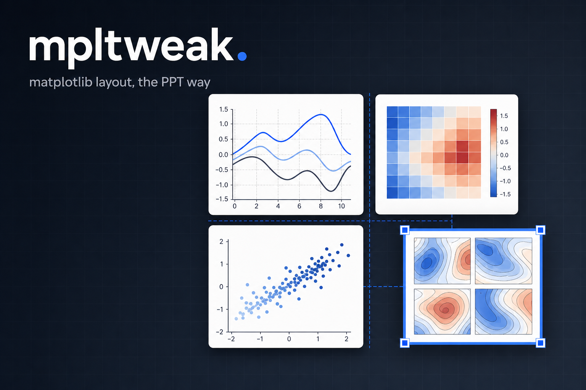
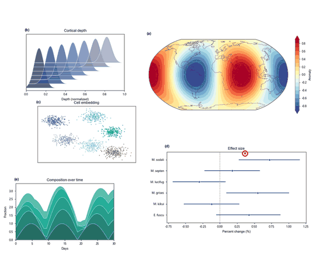
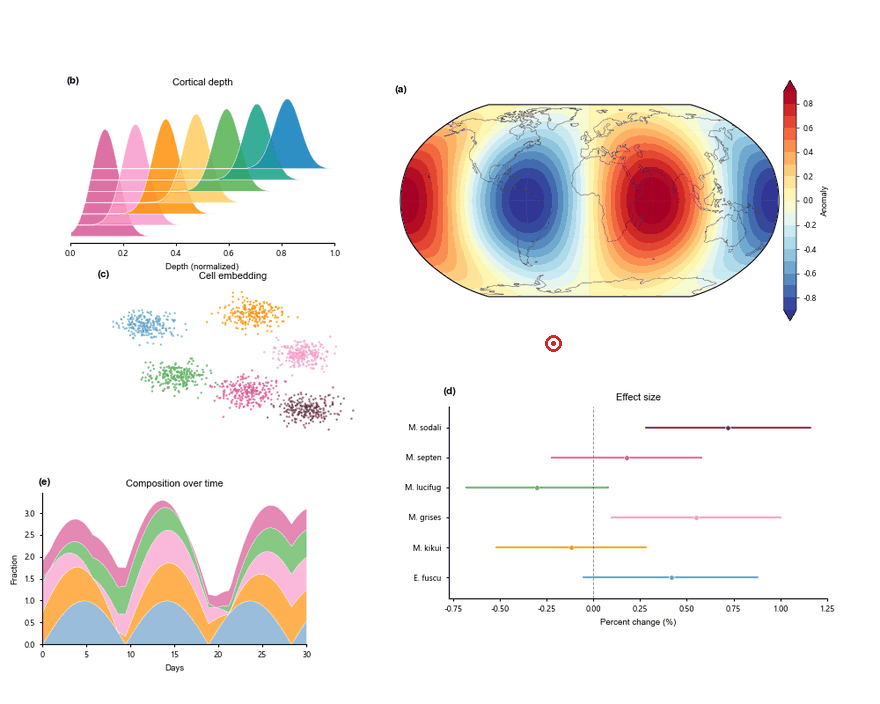

<div align="center">



# mpltweak

**Lay out matplotlib like a slide deck — then write the numbers back into your code.**

[](https://pypi.org/project/mpltweak/)
[](https://pypi.org/project/mpltweak/)
[](LICENSE)

<sub><a href="README.md">中文</a></sub>

</div>

## What it solves

The layout of a multi-panel figure is a set of coupled parameters — panel positions, gutters,
font sizes, legend placement. Changing one usually means rebalancing another, and in a pure-code
workflow the only way to do that is to edit numbers, re-run the script and compare output figures.

**The old way** — edit a number → re-run the script → wait → look at the PNG → still wrong → edit again

**mpltweak** — open the window → drag it into place → `mpltweak apply --write` → the numbers are back in your code

**It only touches style and position — it never invents content.** Text, data and artists stay
exactly what your code says.

## Demos

<table>
<tr>
<td width="50%"><br>
<b>Drag + edge snapping</b><br><sub>Ghost preview and alignment guides while dragging; it clicks into place near a target</sub></td>
<td width="50%"><br>
<b>Align / distribute</b><br><sub>Ctrl-select three panels → one keystroke to left-align and distribute evenly</sub></td>
</tr>
<tr>
<td><br>
<b>Hover to resize text</b><br><sub>Hover a title, axis label, tick label or legend and press <code>+</code> / <code>-</code></sub></td>
<td><br>
<b>Wireframe mode (space)</b><br><sub>Full cartopy redraw <b>494ms → 169ms</b> — layout stops stuttering</sub></td>
</tr>
</table>

## What it actually changes

Take `fig1.py`. **Before** (hand-written numbers, rarely even):

```python
ax1 = fig.add_axes([0.08, 0.66, 0.30, 0.21])
ax2 = fig.add_axes([0.11, 0.38, 0.30, 0.21])
ax3 = fig.add_axes([0.05, 0.08, 0.30, 0.21])
```

**After** (what `mpltweak apply --write` leaves behind):

```diff
-ax1 = fig.add_axes([0.08, 0.66, 0.30, 0.21])
+ax1 = fig.add_axes([0.08, 0.655, 0.300, 0.215])
-ax2 = fig.add_axes([0.11, 0.38, 0.30, 0.21])
+ax2 = fig.add_axes([0.08, 0.380, 0.300, 0.215])
-ax3 = fig.add_axes([0.05, 0.08, 0.30, 0.21])
+ax3 = fig.add_axes([0.08, 0.085, 0.300, 0.215])
```

**Only those numbers move.** No new lines, no `import`, no inserted scaffolding, no trace of the
tool. Font sizes, legend placement, grid and colorbar work the same way — it rewrites parameters
that were **already in your code**.

## Install

```bash
pip install mpltweak
```

## Quick start

### 1 · Your existing script, not a line to change

```python
# fig1.py — just plain matplotlib
import matplotlib.pyplot as plt
import numpy as np

fig = plt.figure(figsize=(10, 8))
x = np.linspace(0, 1, 200)

ax1 = fig.add_axes([0.08, 0.66, 0.30, 0.21])      # the layout is these numbers
ax1.plot(x, np.sin(6 * x))
ax1.set_title('(a)')

ax2 = fig.add_axes([0.11, 0.38, 0.30, 0.21])      # hand-written numbers are rarely even
ax2.scatter(np.random.rand(60), np.random.rand(60), s=8)

ax3 = fig.add_axes([0.05, 0.08, 0.30, 0.21])
ax3.hist(np.random.randn(300), bins=20)

fig.savefig('fig1.png', dpi=150)
```

No `import mpltweak`, no hooks, no decorators.

### 2 · Open the tuning window

```bash
mpltweak fig1.py
```

In the window: **drag** a panel to move it, drag an **edge / corner** to resize,
**Ctrl+click** to multi-select → `Ctrl+Shift+L` to left-align / `Ctrl+Shift+V` to distribute,
**hover text** and press `+` / `-` to resize it, **space** for wireframe mode (fast on heavy
figures), **Ctrl+F** to trim the white margin. Press **`?`** any time for the key cheat-sheet.

**Close the window when you are done.** Not a single character of your script has changed —
the params are sitting in `.tweak_params/fig1.json`.

### 3 · See what it intends to change (read-only)

```bash
mpltweak apply fig1.py
```

Prints the position and font-size list for every axis. Writes nothing.

### 4 · Write it back

```bash
mpltweak apply fig1.py --write
```

```text
✓ 已原位写回: fig1.py
  原位修改 4 处: ax0.pos, ax1.pos, ax2.pos, ax3.pos
  备份: .tweak_params/fig1.tweak.bak
  ✓ Agg 重跑验证通过
  ✓ 语义验证通过（目标图状态 == 参数）
```

It only rewrites the numbers inside your `add_axes([...])` calls; if any verification step
fails, it rolls back.

### 5 · Re-run and look

```bash
python fig1.py
```

### Common cases

| Symptom | What to do |
|---|---|
| No window | Run `mpltweak doctor` for a diagnosis |
| Want to start over | Delete `.tweak_params/fig1.json` (keep it and you continue from last time) |
| Multi-figure script | Every figure gets a window, **whichever you edit is recorded**; `apply` writes each back |
| Script loads data / runs long | `--write --no-verify` to skip the re-run check, or `--timeout 600` |
| **Dragging feels laggy** | Press **space** for wireframe mode: only borders, axes and text are drawn, **no data artists** (measured on a cartopy map: 494ms → 169ms). Press space again to restore |
| You edited the code by hand, then reopened | It will **refuse to re-apply** the old params (so your edits are not silently overwritten) and tell you why; add `--force-resume` to resume anyway |

## Workflow


Until you close the window, not a single character of your script changes — and the write-back
only happens when you explicitly ask for it in step three.

## Keys

| Action | Effect |
|---|---|
| **`?`** | **Open / close the key cheat-sheet** (in-canvas overlay: Esc closes, L switches language) |
| Drag a panel / drag an edge or corner | Move / PowerPoint-style resize (opposite edge pinned; aspect-locked axes scale uniformly) |
| **Ctrl+click** (or Shift+click) | Add / remove from selection; drag on empty space for rubber-band select |
| **Ctrl+Shift+L/R/T/B/C/M** | Align left / right / top / bottom / centre horizontally / centre vertically |
| **Ctrl+Shift+H / V** | Distribute horizontally / vertically (ends fixed, equal gaps) |
| **Ctrl+Z** / **Ctrl+Y** (or Ctrl+Shift+Z) | Undo / redo |
| Hover text, then `+` / `-` | Font size of title, axis label, ticks, legend, colorbar |
| **Space** | Wireframe mode (borders and text only, data artists hidden) |
| **Ctrl+F** | Fit the canvas to its content (trim the white margin; panels keep their pixel size) |
| **Arrow keys** / Shift+arrows | Move the panel (PPT muscle memory) / fine-tune size around its centre |
| Drag a colorbar's long edge / thin side / middle | Length / thickness / move the whole bar |
| Drag the legend | Preview of 8 standard spots, snaps on release |
| `[` `]` · `c` · `C` · `g` · `s` · `x` `y` | Line width / line colour / colormap / grid / spines / linear-log axes |
| `n` · `e` | Snapping toggle / manual export |
| Drag the window edge | Change the canvas size (written back as `figsize`) |

## Three-layer verification

`--write` never edits blindly, and every step is reversible:

1. **It runs** — the script is re-run headlessly with Agg; a non-zero exit rolls back immediately.
2. **It did the right thing** — the target figure's state is dumped and compared field by field
   against the params (position / font size / grid / spines / clim). "Runs, but the layout never
   reached the target figure" counts as a failure.
3. **Retry with another anchor** — the `savefig` matching that figure index → main anchor → end of
   script; only when all of them fail does it roll back.

The backup lives in `.tweak_params/<script>.tweak.bak` (never scattered into your source tree),
and a slow script that times out is not treated as a failure — you are simply told to confirm.

## Params file (`.tweak_params/*.json`)

The params file is a **public format** — edit it by hand, or let an AI / agent generate it, and
`--write` will still apply it. The top-level `version` field marks the format revision (currently 3)
so the tool can tell how to read older files:

```jsonc
{
  "version": 3,
  "script": "fig1.py",
  "figsize_px": [1500, 700],             // canvas in logical pixels (null if never resized)
  "figsize_in": [15.0, 7.0],             // inches written back to figsize
  "axes": [
    {
      "index": 0,                        // = order in fig.axes
      "pos": [0.048, 0.655, 0.30, 0.215],  // [x0, y0, w, h], figure-normalised
      "aspect_locked": false,
      "title_fontsize": 9.0,
      "label_fontsize": 8.0,
      "tick_fontsize": 8.0,
      "grid": false,
      "spines": { "top": false, "right": false },
      "xscale": "linear",
      "yscale": "linear",
      "is_colorbar": false,
      "clim": [-2.0, 2.0],
      "cmap": "RdBu_r",
      "lines": [ { "index": 0, "linewidth": 1.2, "color": "#0F4D92" } ],
      "legend": { "loc": "upper right", "fontsize": 8.0 }
    }
  ]
}
```

## Development

```bash
git clone https://github.com/shdbl/mpltweak && cd mpltweak
pip install -e .
python tests/test_tweak.py       # interactive core
python tests/test_events.py      # event paths
python tests/test_redo.py        # undo / redo
python tests/test_writeback.py   # AST write-back + three-layer verification
python tools/crosscheck.py       # environment / API compatibility check
```

```text
src/mpltweak/
├── cli.py          # mpltweak <script> | apply | doctor
├── launch.py       # run the script → attach windows → save params on close
├── toolbox.py      # interactive core (the Tweak controller, pure matplotlib events)
├── params.py       # params JSON spec
├── apply.py        # change list / write-back entry point
├── writeback.py    # AST lookup + in-place / block write-back
└── verify.py       # semantic verification (re-run, compare field by field)
```

`toolbox.py` also works as an **embedded API** (`from mpltweak.toolbox import gaitu`),
but the CLI is the intended interface — your scripts should never mention this tool.

## License

MIT
