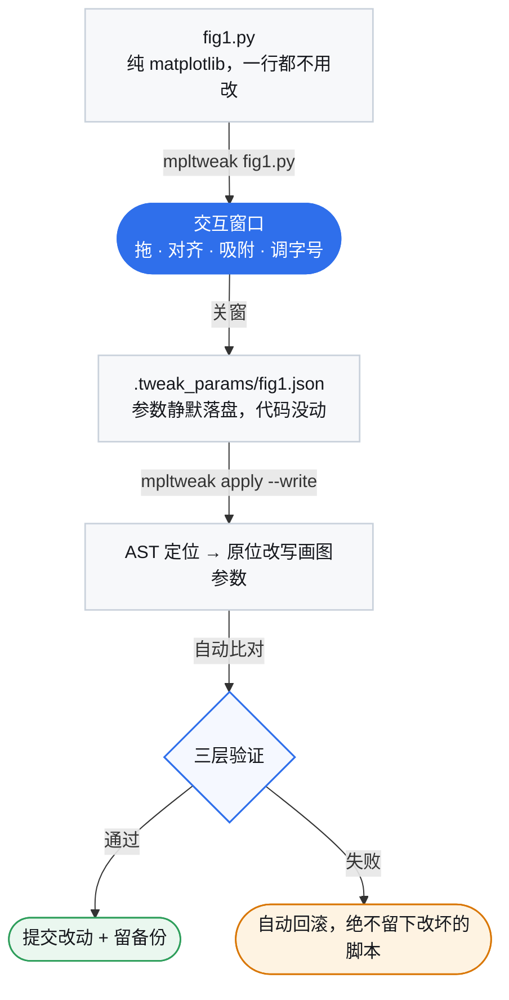

<div align="center">


# mpltweak

**像在 PPT 里调多图排版一样调 matplotlib，然后把参数写回你的代码。**

[](https://pypi.org/project/mpltweak/)
[](https://pypi.org/project/mpltweak/)
[](LICENSE)
[](https://github.com/shdbl/mpltweak/actions/workflows/tests.yml)

**中文** | [English](https://github.com/shdbl/mpltweak/blob/main/README.en.md)

</div>

## 目录

- [它解决什么问题](#它解决什么问题)
- [演示](#演示)
- [它到底改了什么](#它到底改了什么)
- [安装](#安装)
- [快速开始](#快速开始)
- [键位速查](#键位速查)
- [工作流](#工作流)
- [三层验证](#三层验证)
- [参数文件](#参数文件)
- [给 AI / agent 的排版接口](#给-ai--agent-的排版接口)
- [人 + agent 怎么分工](#人--agent-怎么分工)
- [开发](#开发)

## 它解决什么问题

调一张多面板图（multi-panel figure）时，麻烦通常出在排版而不是数据：挪一下子图，
旁边的轴标签就被挡住；字号放大一点，图例又压到曲线上。而每改一次，都要重跑脚本、再看一遍图。

**如果能像在 PPT 里摆放图片那样直接拖，就不必一遍遍改数字了 —— mpltweak 做的就是这件事。**

| 方式 | 流程 |
|---|---|
| **传统方式** | 改一个数字 → 重跑脚本 → 等几十秒 → 看 PNG → 还是不对 → 再改 |
| **mpltweak** | 打开窗口 → 拖到位 → `mpltweak apply --write` → 那几个数字回到代码里 |

**核心特性：确定性写回原源码。** AST 精确定位，写回分两种方式：**代码里写的是字面量时，直接改那几个数字**（最干净，不插入任何东西）；**否则插入一个自包含的调整块**（不加 import、不改动你原有的逻辑）。两种方式都自带三层验证（能跑通 / 真的改对了 / 换锚点重试），全失败自动回滚，**绝不会留下改坏的脚本**。

**正因为要动源码，才必须做到确定性** —— 这是 mpltweak 的设计前提。

**它只管样式和位置，不发明内容** —— 文字、数据、图形仍完全由你的代码决定。

## 演示

<table>
<tr>
<td width="50%"><br>
<b>拖动 + 边缘吸附</b><br><sub>拖动时给出 ghost 预览与对齐参考线，靠近对齐位置自动贴合</sub></td>
<td width="50%"><br>
<b>多选对齐 / 均分</b><br><sub>Ctrl 加选三个面板 → 一键左对齐 + 垂直均分</sub></td>
</tr>
<tr>
<td><br>
<b>悬停改字号</b><br><sub>鼠标悬停标题、轴标签、刻度或图例，按 <code>+</code> / <code>-</code> 直接调</sub></td>
<td><br>
<b>线框模式提速（空格）</b><br><sub>cartopy 全球图全量重绘 <b>494ms → 169ms</b>，拖动不再卡顿</sub></td>
</tr>
</table>

**完整的 PPT 式操作手势：** 拖动面板、Ctrl 多选、对齐 / 均分（Ctrl+Shift+L/R/T/B/C/M、H/V）、边缘吸附（带参考线）、Ctrl+F 适配画布裁白边、空格切线框模式、悬停改字号、图例吸附 8 个标准位、colorbar 调长度 / 厚度。

**深度支持科研场景：** cartopy 地图、colorbar（位置 / clim / cmap）、多 mappable 精确配对（按接收者变量名 / `fig.colorbar(cs, ax=ax1)` 的显式父轴）、`matplotlib.use('Agg')` 脚本不用改。

## 它到底改了什么

以 `fig1.py` 为例。**动手前**（手写的数字，通常都不齐）：

```python
ax1 = fig.add_axes([0.08, 0.66, 0.30, 0.21])
ax2 = fig.add_axes([0.11, 0.38, 0.30, 0.21])
ax3 = fig.add_axes([0.05, 0.08, 0.30, 0.21])
```

**你拖完之后**（`mpltweak apply --write` 的结果）：

```diff
-ax1 = fig.add_axes([0.08, 0.66, 0.30, 0.21])
+ax1 = fig.add_axes([0.08, 0.655, 0.300, 0.215])
-ax2 = fig.add_axes([0.11, 0.38, 0.30, 0.21])
+ax2 = fig.add_axes([0.08, 0.380, 0.300, 0.215])
-ax3 = fig.add_axes([0.05, 0.08, 0.30, 0.21])
+ax3 = fig.add_axes([0.08, 0.085, 0.300, 0.215])
```

**这是第一种情况：代码里写的就是字面量，所以只动了这些数字** —— 没有新增一行、没有加 `import`、没有引入任何依赖。
字号、图例位置、网格、colorbar 同理 —— 改的都是你代码里**原本就有的**参数。

如果位置是 `plt.subplots()` / `plt.subplot(1,2,n)` / `GridSpec` 算出来的，**源码里根本没有数字可改** —— 这在真实脚本里很常见。这种图会改成**插入一个自包含的调整块**：

```python
# ===== 自动布局调整（由调图工具生成，勿手改；重复写回会整体替换）=====
# 本块由 mpltweak 自动生成于 2026-10-10 10:15（可手动微调，勿删上下两行标记）
for _ax, _p in zip(fig.axes, [
    [0.0480, 0.6550, 0.3000, 0.2150],
    [0.0480, 0.3700, 0.3000, 0.2150],
    [0.0480, 0.0850, 0.3000, 0.2150],
    [0.4550, 0.5600, 0.4300, 0.3100],
]):
    _ax.set_position(_p)
# ===== 自动布局调整结束 =====
```

块是**自包含**的：不加 `import`、不依赖 matplotlib 之外的任何东西、不改动你原有的逻辑。重复写回会**整体替换**它，不会越积越多。两种方式都有三层验证 + 失败自动回滚兜底。

这就是确定性写回的价值：mpltweak 用 AST 精确定位 + 三层验证，**让排版结果真正落进你的代码里，而不是只存在于工具中**。

## 不适用场景（先说清楚）

写回验证要在**你的机器上、用你的环境把整个脚本重跑一遍**——这是机制的一部分，不是可选步骤
（`--no-verify` 能跳过，但那等于关掉唯一的安全网）。所以下面这些脚本它帮不上忙：

| 脚本特征 | 为什么 |
|---|---|
| 跑一次要很久（分钟级以上） | 每次写回都要重跑；`--timeout 600` 只是放宽等待，不能免除 |
| 要读大数据 / 依赖重环境 / 要联网或凭据 | 无头重跑会卡住或失败 |
| 中途需要人工输入（`input()`、交互式选择） | 无头重跑直接堵死 |
| 需要在特定交互后端才有意义的图 | 验证固定用 Agg 无头后端 |

这类脚本走只读路线（`mpltweak describe` / `mpltweak check`，都不跑写回），或者手动改代码。
它的目标用户是**本地跑得动的小中型科研绘图脚本**。

## 安装

下面所有命令都在**终端**里执行 —— Windows 用 cmd / PowerShell，macOS / Linux 用 Terminal，
在 PyCharm 里则是底部的 **Terminal** 面板（**不是** Python Console / 交互式解释器）。
调图前先 `cd` 到脚本所在目录。

```bash
pip install mpltweak            # 核心：describe / check / apply / mcp
pip install "mpltweak[qt]"      # 要**开窗拖图**再加这个（装 PyQt5 图形后端）
```

**为什么分成两步**：开窗需要一个图形后端（PyQt5，约 100MB），而
服务器 / headless / 纯 agent 场景只用 `describe` / `check` / `apply` / `mcp`，
不该为此装一整套 Qt；有些环境本来也已经装了 PySide6 / PyQt6。
**没装图形后端也能跑 CLI** —— 只是 `mpltweak <脚本>` 会提示你去装哪一个。

> 命令不在 PATH 时（例如用 `pip --user` 装的），把本文的 `mpltweak` 换成
> `python -m mpltweak` 即可，用法完全一样。

## 快速开始

### 1 · 你原来的脚本，一行都不用改

```python
# fig1.py —— 就是平时写的 matplotlib
import matplotlib.pyplot as plt
import numpy as np

fig = plt.figure(figsize=(10, 8))
x = np.linspace(0, 1, 200)

ax1 = fig.add_axes([0.08, 0.66, 0.30, 0.21])      # 位置就是这几个数字
ax1.plot(x, np.sin(6 * x))
ax1.set_title('(a)')

ax2 = fig.add_axes([0.11, 0.38, 0.30, 0.21])      # 手写的数字，通常都不齐
ax2.scatter(np.random.rand(60), np.random.rand(60), s=8)

ax3 = fig.add_axes([0.05, 0.08, 0.30, 0.21])
ax3.hist(np.random.randn(300), bins=20)

fig.savefig('fig1.png', dpi=150)
```

不需要 `import mpltweak`，不需要任何钩子。

### 2 · 打开调图窗口

```bash
mpltweak fig1.py
```

窗口里：**拖**面板移动、拖**边 / 角**缩放、**Ctrl 加选**多个面板 →
`Ctrl+Shift+L` 左对齐 / `Ctrl+Shift+V` 垂直均分、鼠标**悬停文字**按 `+` `-` 调字号、
**空格**切线框（大图提速）、**Ctrl+F** 裁掉白边。按 **`?`** 随时打开键位帮助页。

**调完直接关窗。** 此时脚本一个字符都没变，参数落在 `.tweak_params/fig1.json`。

### 3 · 先看它打算改什么（只读）

```bash
mpltweak apply fig1.py
```

打印每个轴的位置、字号清单，不写任何文件。

### 4 · 写回

```bash
mpltweak apply fig1.py --write
```

```text
✓ 已原位写回: fig1.py
  原位修改 4 处: ax0.pos, ax1.pos, ax2.pos, ax3.pos
  备份: .tweak_params/fig1.tweak.bak
  ✓ Agg 重跑验证通过
  ✓ 语义验证通过（目标图状态 == 参数）
```

代码里写的是字面量时，它只改 `add_axes([...])` 里那几个数字；否则插入一个自包含的调整块。任何一步验证不过就自动回滚。

### 5 · 重跑看图

```bash
python fig1.py
```

### 常见情况

| 现象 | 处理 |
|---|---|
| 没弹窗 | 运行 `mpltweak doctor` 看诊断 |
| 想从头调 | 删掉 `.tweak_params/fig1.json`（不删就是接着上次续调） |
| 多图脚本 | 每张图都会弹窗，**改哪张记哪张**；`mpltweak apply` 逐张写回 |
| 脚本要读数据 / 跑很久 | 先试 `--timeout 600` **放宽**等待。`--no-verify` 会**完全跳过重跑验证**——那是写坏代码时唯一的自动安全网，只在脚本确实无法在无头环境重跑时才用，且用前请确认脚本已在版本控制里 |
| **拖动特别卡** | 按 **空格** 切线框模式：只画边框、坐标轴和文字，**不渲染数据图元**（cartopy 大图实测 494ms → 169ms），挪完再按一次空格恢复 |
| 手动改过代码后再开窗 | 会自动**不套用**上次参数（避免静默覆盖你的改动）并给出提示；确要接着上次调，加 `--force-resume` |
| 脚本里开着 `constrained_layout` / `autolayout` | 开窗与写回时会提示（**带行号**）：布局引擎在每次绘制时重算轴位置，拖拽/写回的位置会被它覆盖。调图前先关掉（或把要精调的轴改成 `add_axes([...])`，引擎不管这类轴） |

## 原位改数字，还是插入调整块

`apply --write` 默认 `--style auto`：**每张图各自决定**，规则如下。

| 这张图的情况 | 结果 |
|---|---|
| 代码里有可改的字面量（`add_axes([...])`、`set_title/set_xlabel(fontsize=)`、`tick_params(labelsize=)`、`grid(...)`） | **原位改那几个数字**，脚本风格不变 |
| 一个字段都改不到（典型：位置来自 `plt.subplots()` / `GridSpec` 的网格轴） | 整张图**退到插入调整块** |
| 有的字段能原位改、有的不能（`clim` / `cmap` / `legend` / `spines`、网格轴位置、colorbar 宿主轴位置） | **保持原位**，改不到的字段进"未原位应用"清单**逐条列出**（不静默丢），需要时用 `--style block` 统一 |

想强制统一：`--style inplace`（一处都不插块，改不了的保持原样）或 `--style block`（一律插块）。

**跨轮可能混用**：先原位改过数字，后来某轮因为"一个字段都没落地"退成了块，文件里就会同时
存在两种形态。两者都有效，但读代码的人容易困惑。要彻底统一，先从备份恢复（
`.tweak_params/<脚本>.tweak.bak` 是写回前的原文），再用 `--style block` 写一次——
块是整体替换的，单靠再写一次并不会把之前原位改掉的数字改回去。

## 键位速查

| 操作 | 作用 |
|---|---|
| **`?`** | **打开 / 关闭键位帮助页**（画布内浮层：Esc 关闭，L 切换中英文） |
| 拖面板 / 拖边框、角 | 移动 / PPT 式缩放（对边固定；锁长宽比的轴自动等比） |
| **Ctrl+点击**（或 Shift+点击） | 多选加选 / 减选；拖空白处橡皮筋框选 |
| **Ctrl+Shift+L/R/T/B/C/M** | 对齐：左 / 右 / 上 / 下 / 水平居中 / 垂直居中 |
| **Ctrl+Shift+H / V** | 均分：水平 / 垂直（两端不动，中间等间距） |
| **Ctrl+Z** / **Ctrl+Y**（或 Ctrl+Shift+Z） | 撤销 / 重做 |
| 悬停文字后 `+` / `-` | 标题、轴标签、刻度、图例、colorbar 的字号 |
| **空格** | 线条模式（只留边框与文字，隐藏数据图元） |
| **Ctrl+F** | 适配画布到内容（裁掉四周白边，子图像素不变） |
| **方向键** / Shift+方向键 | 移动面板（PPT 习惯）/ 微调尺寸（中心不动） |
| 拖 colorbar 长轴端点 / 细条边 / 中点 | 调长度 / 调厚度 / 整条平移 |
| 拖图例 | 8 个标准位预览 + 松手吸附 |
| `[` `]` · `c` · `C` · `g` · `s` · `x` `y` | 线宽 / 线色 / colormap / 网格 / 边框 / 线性对数轴 |
| `n` · `e` | 吸附开关 / 手动导出 |
| 拖窗口边缘 | 改画布尺寸（写回 `figsize`） |

## 工作流



从打开窗口到 `mpltweak apply --write`，中间任何一步（包括关窗之后）脚本一个字符都不会变；
写回是你在第三步显式点头后的动作。

## 三层验证

`--write` 不是"盲改"，每一步都可回滚：

1. **能跑通** —— 改完用 Agg 无头重跑，退出码非 0 直接回滚；
2. **改对了** —— 重跑后 dump 目标图状态，与参数里的位置 / 字号 / grid / spines / clim
   逐项比对；"跑通了但布局没落到目标图"会被判失败；
3. **换锚点重试** —— 图号对应的 `savefig` → 主锚点 → 脚本尾，全部失败才回滚。

**这是确定性写回的保障机制。** 备份写在 `.tweak_params/<脚本>.tweak.bak`（不散落到代码目录）；
并发跑两个 `apply --write` 时，各自还会多留一份带 pid 的副本（`.tweak.<pid>.bak`），
避免它们互相覆盖那唯一的恢复点；同一个脚本的写回用 `<脚本>.apply.lock` 串行化，
所以两处改动不会"凭空消失"。
慢脚本超时不会被误判为失败，只提示手动确认。

写回是**原子替换**（先写临时文件再 `os.replace`），所以脚本不会出现"改到一半"的状态；
代价是**文件 inode 会变**：如果你用硬链接指向这个脚本，替换后链接仍指向旧内容。
软链接不受影响，文件权限位会被保留。

### 后悔了：`mpltweak revert`

写回错了、或者拖完发现还是原来那版好看？不用去翻备份：

```bash
mpltweak revert fig1.py            # 只预览：会改回哪几行（默认，不动代码）
mpltweak revert fig1.py --write    # 真的回退到"上次写回之前"
```

它用的就是 `.tweak_params/<脚本>.tweak.bak` 那份备份（每次 `apply --write` 之前自动留的）。
**revert 自身也可逆**：覆盖前会把当前版本另存为 `<脚本>.revert.bak`，所以手滑了还能再回去。
恢复是**字节级原样复制**（BOM / 换行 / 编码都不动）。

### 慢脚本：`--verify-fast`（快速档）

脚本要跑几分钟、你只是想先看一眼结果，可以用快速档：

```bash
mpltweak apply fig1.py --write --verify-fast
```

**它保证什么**：源码仍然是合法 Python（写坏了当场回滚，不会留下跑不起来的脚本）。

**它不保证什么**（重要）：**没有重跑脚本** —— 不保证脚本能跑通，也不保证布局真的落到目标图上。
所以它只适合"先快速落实、马上自己跑一遍看图"的迭代过程；正式落实请去掉这个开关。
`--json` 里会如实标 `"verify_mode": "fast"`、`"verified": null`，agent 一眼能看出来这份结果没经过重跑。

### 接进 CI：`--strict`

`check` 默认把布局引擎冲突（`constrained_layout` / `autolayout`）当**提示** —— 那是 matplotlib 的正常写法。
如果你的项目要求"别用会被引擎覆盖的布局方式"，加 `--strict` 让它变成**问题**（退出码 1）：

```bash
mpltweak check fig1.py --strict            # 有布局引擎冲突就 rc=1
mpltweak apply fig1.py --write --strict    # 有冲突时拒绝写回（要放行加 --allow-layout-conflict）
```

`check --json` 也是天然的 CI 用例（`ok` 字段 + 退出码）：

```bash
mpltweak check figures/*.py --json | jq -e '.ok'    # 有问题就非 0 退出
```

## 参数文件

参数文件是**公开格式** —— 可以手工改，也可以让 AI / agent 直接生成，`--write` 一样能落实。
顶层 `version` 字段标记格式版本（当前为 4；旧版文件照读），工具据此判断跨版本兼容性：

```jsonc
{
  "version": 4,
  "script": "fig1.py",
  "figsize_px": [1500, 700],             // 画布逻辑像素（未 resize 为 null）
  "figsize_in": [15.0, 7.0],             // 写回 figsize 的英寸数
  "axes": [
    {
      "index": 0,                        // = fig.axes 顺序
      "pos": [0.048, 0.655, 0.30, 0.215],  // [x0, y0, w, h]，figure 归一化坐标
      "aspect_locked": false,
      "title_fontsize": 9.0,
      "label_fontsize": 8.0,
      "tick_fontsize": 8.0,
      "grid": false,
      "spines": { "top": false, "right": false },
      "xscale": "linear",
      "yscale": "linear",
      "is_colorbar": false,
      "clim": [-2.0, 2.0],
      "xlim": [-0.01, 1.01],             // 轴范围：只在脚本**显式固定**过时才记（autoscale 不记）
      "ylim": [0.0, 10.0],
      "cell": [1, 2, 0, 1],              // 网格身份 [行数, 列数, 起始行, 起始列]（手工 add_axes 为 null）
      "cmap": "RdBu_r",
      "lines": [ { "index": 0, "linewidth": 1.2, "color": "#0F4D92" } ],
      "legend": { "loc": "upper right", "fontsize": 8.0 }
    }
  ]
}
```

## 给 AI / agent 的排版接口

大模型能写出正确的绘图代码，但**排版数字基本靠猜** —— 它看不到那张图。

mpltweak 把这部分从"猜"变成"写文件"：

**参数文件是公开 JSON 格式（带 JSON Schema）**，AI 可以直接生成或修改它，不需要"看懂"图。`mpltweak apply --write` 负责确定性落实：AST 定位 + 三层验证 + 失败回滚，**写错了也不会把你的脚本改坏**。

**核心理念：让 AI 管内容，让 mpltweak 管排版。**

```jsonc
// agent 产出这个 → mpltweak apply fig1.py --write → 落进你的源码
{ "axes": [
  { "index": 0, "pos": [0.080, 0.560, 0.395, 0.330],
    "title_fontsize": 9.5, "legend": { "loc": "upper right" } },
  { "index": 1, "pos": [0.525, 0.560, 0.395, 0.330],
    "title_fontsize": 9.5, "legend": { "loc": "upper right" } }
] }
```

**完整的读 → 改 → 写 → 查回路：**

| 命令 | 作用 |
|---|---|
| `mpltweak describe <脚本>` | 不开窗，把**当前排版**导出成参数 JSON（agent 的"读"） |
| `mpltweak schema` | 输出参数文件的 JSON Schema，供 agent 校验自己生成的内容 |
| `mpltweak apply <脚本> --write --json` | 落实回源码，并输出机器可读结果（`--json` 时过程信息全部走 stderr） |
| `mpltweak revert <脚本> [--write]` | 回退到上次写回之前（默认只预览；回退前也会留存当前版本） |
| `mpltweak check <脚本> --json` | 不看图也能检查：对齐 / 等大 / 间距 / 字号 / 越界 / 重叠，**文字按真实渲染尺寸**查（超出画布 = 问题，互相压住 = 提示），另有轴范围不统一提示；布局引擎冲突单独一栏（`--strict` 可升级为问题） |

```bash
mpltweak describe fig1.py -o layout.json    # 读：拿到现在的排版
# ...agent 改 layout.json 里的几个数字...
mpltweak apply fig1.py --write --json       # 写：落回源码并自检
mpltweak check fig1.py --json               # 查：排版体检，输出 JSON
```

**为什么需要"读"**：`add_axes([...])` 这种明写的位置，读源码就够了；但 `plt.subplots()` 的网格、
没写 `fontsize=` 时实际生效的默认值、`tight_layout()` 之后的位置、colorbar 与 cartopy 锁定后的
真实尺寸 —— 这些**源码里没有数字**，得跑一遍才知道。

### 也可以接进 AI 客户端（MCP）

MCP 是可选依赖，装上之后能把 mpltweak 挂进 Claude Desktop / Cursor / Claude Code 等客户端，
让 AI 在对话里直接调（不用敲 shell）。它要求 Python ≥ 3.10：

```bash
pip install "mpltweak[mcp]"
mpltweak mcp                    # 启动 stdio server
```

客户端配置加一段：

```json
{"mcpServers": {"mpltweak": {"command": "mpltweak", "args": ["mcp"]}}}
```

四个工具与上面四个命令一一对应：`describe_layout` / `check_layout` / `params_schema` /
`apply_layout`（默认只读预览，`write=true` 才改代码）。

### 让 AI 直接读这份手册（skill）

仓库里的 `skills/mpltweak/SKILL.md` 是一份**写给 AI 的操作手册**（Agent Skills 格式）：
完整的命令、使用铁律、以及几种人机协作方式。想让自己的 AI 助手学会用 mpltweak，
把这份文件喂给它就行 —— 不用你每次解释一遍怎么用。

## 人 + agent 怎么分工

| 分工 | 怎么做 |
|---|---|
| **人拖 → agent 落盘** | 你开窗拖完，说一句"落盘"，AI 跑 `apply --write` |
| **agent 起草 → 人微调** | 让 AI 按规则先排一版 → 你开窗接着调（参数会续上）→ 确认落盘 |
| **agent 自检** | AI 画完图跑 `check`：不看图也能发现不齐 / 不等大 / 间距不均 / 字号不一 / 越界 / 重叠 |
| **一张图当模板** | `describe` 排好的那张 → 改 `script` 字段 → `apply` 到其它脚本，统一整篇论文的排版 |
| **人拖完，agent 总结** | AI 读参数 JSON，用大白话说明改了什么（可当 commit message 或图注） |

原则很简单：**"好不好看"归你，"精确落实"归它。**

## 开发

```bash
git clone https://github.com/shdbl/mpltweak && cd mpltweak
pip install -e .
python tests/test_tweak.py       # 交互内核
python tests/test_events.py      # 事件路径
python tests/test_redo.py        # 撤销 / 重做
python tests/test_writeback.py   # AST 写回 + 三层验证
python tools/crosscheck.py       # 环境 / API 兼容性自检
```

```text
src/mpltweak/
├── cli.py          # mpltweak <脚本> | apply | doctor
├── launch.py       # 跑脚本 → 挂窗口 → 关窗存参数
├── toolbox.py      # 交互内核（Tweak 控制器，纯 matplotlib 事件）
├── params.py       # 参数 JSON 规范
├── apply.py        # 改动清单 / 写回入口
├── writeback.py    # AST 定位 + 原位 / 块写回
└── verify.py       # 语义验证（重跑后逐项比对）
```

`toolbox.py` 也可作**嵌入 API**（`from mpltweak.toolbox import gaitu`），
但主推 CLI —— 用户脚本里不该出现本工具的任何痕迹。

## License

MIT
