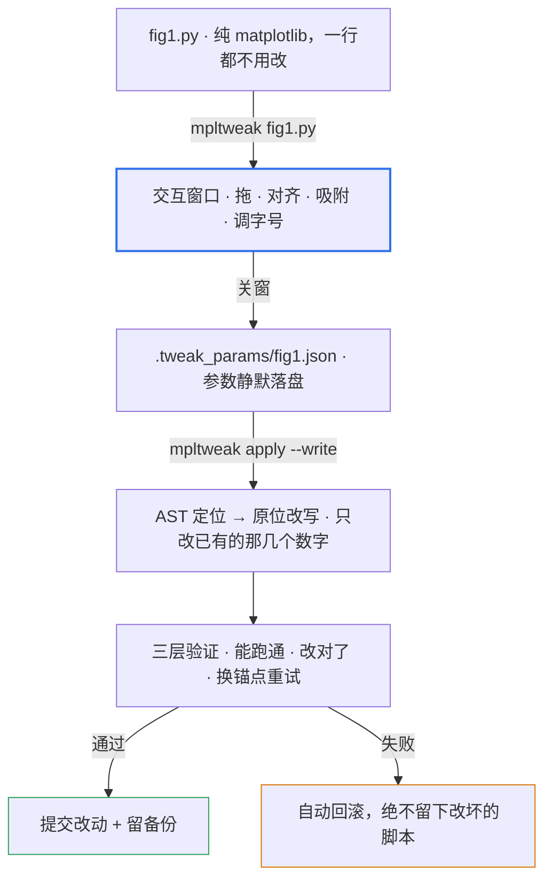

<div align="center">


# mpltweak

**像在 PPT 里调多图排版一样调 matplotlib，然后把参数写回你的代码。**

[](https://pypi.org/project/mpltweak/)
[](https://pypi.org/project/mpltweak/)
[](LICENSE)

<sub>matplotlib 事件驱动 · 零依赖 · AST 确定性写回 · 三层验证</sub>

<sub><code>pip install mpltweak</code> &nbsp;·&nbsp; <a href="README.en.md">English</a></sub>

</div>

## 它解决什么问题

科研绘图脚本里，最耗时的从来不是数据，是**排版**：子图挡住轴标签、间距不匀、
左边缘差 0.02、图例压住曲线、字号在论文里太小……而这一切只能靠
「改一个数字 → 重跑脚本 → 等几十秒 → 看 PNG → 再改」的循环。

mpltweak 把这段循环变成**肉眼 + 鼠标**：

```text
  改代码 → 重跑 → 看图 → 再改 ...                      ← 传统方式
  ──────────────────────────────────────────────
  mpltweak fig1.py  →  拖  →  mpltweak apply --write   ← 三步
```

**它只管样式和位置，不发明内容** —— 文字、数据、图形仍完全由你的代码决定。

## 演示

<table>
<tr>
<td width="50%"><br>
<b>拖动 + 边缘吸附</b><br><sub>拖动时给出 ghost 预览与对齐参考线，靠近对齐位置自动贴合</sub></td>
<td width="50%"><br>
<b>多选对齐 / 均分</b><br><sub>Ctrl 加选三个面板 → 一键左对齐 + 垂直均分，从"随手写的参数"变整齐一列</sub></td>
</tr>
<tr>
<td><br>
<b>悬停改字号</b><br><sub>鼠标悬停标题、轴标签、刻度或图例，按 <code>+</code> / <code>-</code> 直接调</sub></td>
<td><br>
<b>重图切线框（空格）</b><br><sub>cartopy 全球图全量重绘 <b>494ms → 169ms</b>，排版时不再卡</sub></td>
</tr>
</table>

## 工作流



关窗之前，脚本一个字符都不会变；写回是你在第三步显式点头后的动作。

## 安装

```bash
pip install mpltweak            # 内核
pip install "mpltweak[qt]"      # 内核 + PyQt5
```

两者唯一的区别是**要不要顺带装 PyQt5**：

| | `mpltweak` | `mpltweak[qt]` |
|---|---|---|
| `mpltweak apply` / `mpltweak doctor` | ✅ | ✅ |
| 弹出交互窗口 | 需要环境里**已有** Qt（如 Anaconda 自带的 PyQt5/PySide） | ✅ 一定可以（装上 PyQt5） |

所以：**不确定就装 `[qt]`**（多约 60MB，但省心）；环境里已经有 Qt 的话装内核就够。

装完先自检：`mpltweak doctor`（Python / matplotlib 版本、可用后端、字体）

> 脚本里写了 `matplotlib.use('Agg')`（科研脚本批量出图的常见写法）**不需要改** ——
> 启动器会临时接管后端，`savefig` 的结果与原来完全一致。

## 快速开始

### 1 · 你原来的脚本，一行都不用改

```python
# fig1.py —— 就是平时写的 matplotlib
import matplotlib.pyplot as plt
import numpy as np

fig = plt.figure(figsize=(10, 8))
x = np.linspace(0, 1, 200)

ax1 = fig.add_axes([0.08, 0.66, 0.30, 0.21])      # 位置就是这几个数字
ax1.plot(x, np.sin(6 * x))
ax1.set_title('(a)')

ax2 = fig.add_axes([0.11, 0.38, 0.30, 0.21])      # 手写的数字，通常都不齐
ax2.scatter(np.random.rand(60), np.random.rand(60), s=8)

ax3 = fig.add_axes([0.05, 0.08, 0.30, 0.21])
ax3.hist(np.random.randn(300), bins=20)

fig.savefig('fig1.png', dpi=150)
```

不需要 `import mpltweak`，不需要任何钩子。

### 2 · 弹窗调图

```bash
mpltweak fig1.py
```

窗口里：**拖**面板移动、拖**边 / 角**缩放、**Ctrl 加选**多个面板 →
`Ctrl+Shift+L` 左对齐 / `Ctrl+Shift+V` 垂直均分、鼠标**悬停文字**按 `+` `-` 调字号、
**空格**切线框（大图提速）、**Ctrl+F** 裁掉白边。完整键位见下表。

**调完直接关窗。** 此时脚本一个字符都没变，参数落在 `.tweak_params/fig1.json`。

### 3 · 先看它打算改什么（只读）

```bash
mpltweak apply fig1.py
```

打印每个轴的位置、字号清单，不写任何文件。

### 4 · 写回

```bash
mpltweak apply fig1.py --write
```

```text
✓ 已原位写回: fig1.py
  原位修改 4 处: ax0.pos, ax1.pos, ax2.pos, ax3.pos
  备份: .tweak_params/fig1.tweak.bak
  ✓ Agg 重跑验证通过
  ✓ 语义验证通过（目标图状态 == 参数）
```

它在你的脚本里只改 `add_axes([...])` 里那几个数字；任何一步验证不过就自动回滚。

### 5 · 重跑看图

```bash
python fig1.py
```

### 常见情况

| 现象 | 处理 |
|---|---|
| 没弹窗 / 报缺后端 | `mpltweak doctor` 看诊断；缺 Qt 就 `pip install "mpltweak[qt]"` |
| 想从头调 | 删掉 `.tweak_params/fig1.json`（不删就是接着上次续调） |
| 多图脚本 | 每张图都会弹窗，**改哪张记哪张**；`mpltweak apply` 逐张写回 |
| 脚本要读数据 / 跑很久 | `--write --no-verify` 跳过重跑验证，或 `--timeout 600` 放宽 |

## 键位速查

| 操作 | 作用 |
|---|---|
| 拖面板 / 拖边框、角 | 移动 / PPT 式缩放（对边固定；锁长宽比的轴自动等比） |
| **Ctrl+点击**（或 Shift+点击） | 多选加选 / 减选；拖空白处橡皮筋框选 |
| **Ctrl+Shift+L/R/T/B/C/M** | 对齐：左 / 右 / 上 / 下 / 水平居中 / 垂直居中 |
| **Ctrl+Shift+H / V** | 均分：水平 / 垂直（两端不动，中间等间距） |
| **Ctrl+Z** / **Ctrl+Y**（或 Ctrl+Shift+Z） | 撤销 / 重做 |
| 悬停文字后 `+` / `-` | 标题、轴标签、刻度、图例、colorbar 的字号 |
| **空格** | 线条模式（只留边框与文字，隐藏数据图元） |
| **Ctrl+F** | 适配画布到内容（裁掉四周白边，子图像素不变） |
| **方向键** / Shift+方向键 | 移动面板（PPT 习惯）/ 微调尺寸（中心不动） |
| 拖 colorbar 长轴端点 / 细条边 / 中点 | 调长度 / 调厚度 / 整条平移 |
| 拖图例 | 8 个标准位预览 + 松手吸附 |
| `[` `]` · `c` · `C` · `g` · `s` · `x` `y` | 线宽 / 线色 / colormap / 网格 / 边框 / 线性对数轴 |
| `n` · `e` · `?` | 吸附开关 / 手动导出 / 帮助 |
| 拖窗口边缘 | 改画布尺寸（写回 `figsize`） |

## 三层验证

`--write` 不是"盲改"，每一步都可回滚：

1. **能跑通** —— 改完用 Agg 无头重跑，退出码非 0 直接回滚；
2. **改对了** —— 重跑后 dump 目标图状态，与参数里的位置 / 字号 / grid / spines / clim
   逐项比对；"跑通了但布局没落到目标图"会被判失败；
3. **换锚点重试** —— 图号对应的 `savefig` → 主锚点 → 脚本尾，全部失败才回滚。

备份写在 `.tweak_params/<脚本>.tweak.bak`（不散落到代码目录）；
慢脚本超时不会被误判为失败，只提示手动确认。

## `.tweak_params/*.json` 规范（version 3）

参数文件是**公开格式** —— 可以手工改，也可以让 AI / agent 直接生成，`--write` 一样能落实：

```jsonc
{
  "version": 3,
  "script": "fig1.py",
  "figsize_px": [1500, 700],             // 画布逻辑像素（未 resize 为 null）
  "figsize_in": [15.0, 7.0],             // 写回 figsize 的英寸数
  "axes": [
    {
      "index": 0,                        // = fig.axes 顺序
      "pos": [0.048, 0.655, 0.30, 0.215],  // [x0, y0, w, h]，figure 归一化坐标
      "aspect_locked": false,
      "title_fontsize": 9.0,
      "label_fontsize": 8.0,
      "tick_fontsize": 8.0,
      "grid": false,
      "spines": { "top": false, "right": false },
      "xscale": "linear",
      "yscale": "linear",
      "is_colorbar": false,
      "clim": [-2.0, 2.0],
      "cmap": "RdBu_r",
      "lines": [ { "index": 0, "linewidth": 1.2, "color": "#0F4D92" } ],
      "legend": { "loc": "upper right", "fontsize": 8.0 }
    }
  ]
}
```

## 开发

```bash
git clone https://github.com/shdbl/mpltweak && cd mpltweak
pip install -e .
python tests/test_tweak.py       # 交互内核
python tests/test_events.py      # 事件路径
python tests/test_redo.py        # 撤销 / 重做
python tests/test_writeback.py   # AST 写回 + 三层验证
python tools/crosscheck.py       # 环境 / API 兼容性自检
```

```text
src/mpltweak/
├── cli.py          # mpltweak <脚本> | apply | doctor
├── launch.py       # 跑脚本 → 挂窗口 → 关窗存参数
├── toolbox.py      # 交互内核（Tweak 控制器，纯 matplotlib 事件）
├── params.py       # 参数 JSON 规范（version 3）
├── apply.py        # 改动清单 / 写回入口
├── writeback.py    # AST 定位 + 原位 / 块写回
└── verify.py       # 语义验证（重跑后逐项比对）
```

`toolbox.py` 也可作**嵌入 API**（`from mpltweak.toolbox import gaitu`），
但主推 CLI —— 用户脚本里不该出现本工具的任何痕迹。

## License

MIT
