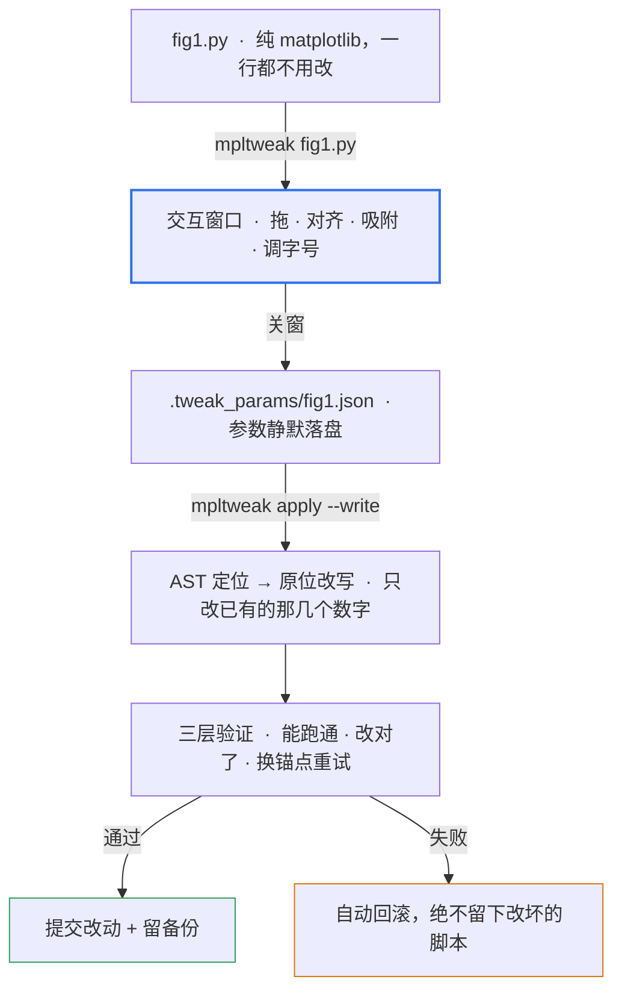

<div align="center">


# mpltweak

**像在 PPT 里调多图排版一样调 matplotlib，然后把结果写回你的代码。**

[](https://pypi.org/project/mpltweak/)
[](LICENSE)
[]()

`pip install mpltweak` · 只依赖 matplotlib（交互窗口另需 PyQt5 或 Tk）

[English](README.en.md) · **中文**

</div>

---

## 布局是看出来的，不是猜出来的

拖、对齐、吸附 —— 在真实的图上把位置摆对。关掉窗口，参数落在 `.tweak_params/`。

一条 `mpltweak apply --write`，它按 AST 找到那几个数字，**原位改写**，不插一行杂物；
备份、重跑、语义比对，任何一步不过就自动回滚 —— **不留改坏的脚本**。

不 import、不注入、不留钩子。你的源码里，没有它来过的痕迹。



第 ⑤ 步长这样（真实运行输出 + 真实 diff）：


---

## 演示

<table>
<tr>
<td width="50%"><br>
<b>拖动 + 边缘吸附</b><br>拖动时给出 ghost 预览与对齐参考线，靠近对齐位置自动贴合</td>
<td width="50%"><br>
<b>多选对齐 / 均分</b><br>Ctrl 加选三个面板 → 一键左对齐 + 垂直均分，从"随手写的参数"变整齐一列</td>
</tr>
<tr>
<td><br>
<b>悬停改字号</b><br>鼠标悬停标题、轴标签、刻度或图例，按 <code>+</code> / <code>-</code> 直接调</td>
<td><br>
<b>重图切线框（空格）</b><br>cartopy 全球图全量重绘 <b>494ms → 169ms</b>，排版时不再卡</td>
</tr>
</table>

---

## 安装

```bash
pip install mpltweak            # 内核（可做写回 / 自检，无需窗口）
pip install "mpltweak[qt]"      # 带 PyQt5 交互窗口（Windows / Linux 推荐）
```

环境自检：

```bash
mpltweak doctor     # Python / matplotlib 版本、可用后端、字体等
```

> 脚本里写了 `matplotlib.use('Agg')`（科研脚本批量出图的常见写法）**不需要改** ——
> 启动器会临时接管后端，`savefig` 的结果与原来完全一致。

---

## 键位速查

| 操作 | 作用 |
|---|---|
| 拖面板 / 拖边框、角 | 移动 / PPT 式缩放（对边固定；锁长宽比的轴自动等比） |
| **Ctrl+点击**（或 Shift+点击） | 多选加选 / 减选；拖空白处橡皮筋框选 |
| **Ctrl+Shift+L/R/T/B/C/M** | 对齐：左 / 右 / 上 / 下 / 水平居中 / 垂直居中 |
| **Ctrl+Shift+H / V** | 均分：水平 / 垂直（两端不动，中间等间距） |
| **Ctrl+Z** / **Ctrl+Y**（或 Ctrl+Shift+Z） | 撤销 / 重做 |
| 悬停文字后 `+` / `-` | 标题、轴标签、刻度、图例、colorbar 的字号 |
| **空格** | 线条模式（只留边框与文字，隐藏数据图元）——重图排版提速 |
| **Ctrl+F** | 适配画布到内容（裁掉四周白边，子图像素不变） |
| **方向键** / Shift+方向键 | 移动面板（PPT 习惯）/ 微调尺寸（中心不动） |
| 拖 colorbar 长轴端点 / 细条边 / 中点 | 调长度 / 调厚度 / 整条平移 |
| 拖图例 | 8 个标准位预览 + 松手吸附 |
| `[` `]` · `c` · `C` · `g` · `s` · `x` `y` | 线宽 / 线色 / colormap / 网格 / 边框 / 线性对数轴 |
| `n` · `e` · `?` | 吸附开关 / 手动导出 / 帮助 |
| 拖窗口边缘 | 改画布尺寸（写回 `figsize`） |

---

## 三层验证

`--write` 不是"盲改"，每一步都可回滚：

1. **能跑通** —— 改完用 Agg 无头重跑，退出码非 0 直接回滚；
2. **改对了** —— 重跑后 dump 目标图状态，与参数里的位置 / 字号 / grid / spines / clim
   逐项比对；"跑通了但布局没落到目标图"会被判失败；
3. **换锚点重试** —— 图号对应的 `savefig` → 主锚点 → 脚本尾，全部失败才回滚。

备份写在 `.tweak_params/<脚本>.tweak.bak`（不散落到代码目录）；
慢脚本超时不会被误判为失败，只提示手动确认。

---

## `.tweak_params/*.json` 规范（version 3）

参数文件是**公开格式**——可以手工改，也可以让 AI / agent 直接生成，`--write` 一样能落实：

```jsonc
{
  "version": 3,
  "script": "fig1.py",
  "figsize_px": [1500, 700],             // 画布逻辑像素（未 resize 为 null）
  "figsize_in": [15.0, 7.0],             // 写回 figsize 的英寸数
  "axes": [
    {
      "index": 0,                        // = fig.axes 顺序
      "pos": [0.048, 0.655, 0.30, 0.215],  // [x0, y0, w, h]，figure 归一化坐标
      "aspect_locked": false,
      "title_fontsize": 9.0,
      "label_fontsize": 8.0,
      "tick_fontsize": 8.0,
      "grid": false,
      "spines": { "top": false, "right": false },
      "xscale": "linear",
      "yscale": "linear",
      "is_colorbar": false,
      "clim": [-2.0, 2.0],
      "cmap": "RdBu_r",
      "lines": [ { "index": 0, "linewidth": 1.2, "color": "#0F4D92" } ],
      "legend": { "loc": "upper right", "fontsize": 8.0 }
    }
  ]
}
```

---

## 开发

```bash
git clone https://github.com/shdbl/mpltweak && cd mpltweak
pip install -e .
python tests/test_tweak.py       # 交互内核
python tests/test_events.py      # 事件路径
python tests/test_redo.py        # 撤销 / 重做
python tests/test_writeback.py   # AST 写回 + 三层验证
python tools/crosscheck.py       # 环境 / API 兼容性自检
```

```
src/mpltweak/
├── cli.py          # mpltweak <脚本> | apply | doctor
├── launch.py       # 跑脚本 → 挂窗口 → 关窗存参数
├── toolbox.py      # 交互内核（Tweak 控制器，纯 matplotlib 事件）
├── params.py       # 参数 JSON 规范（version 3）
├── apply.py        # 改动清单 / 写回入口
├── writeback.py    # AST 定位 + 原位 / 块写回
└── verify.py       # 语义验证（重跑后逐项比对）
```

`toolbox.py` 也可作**嵌入 API**（`from mpltweak.toolbox import gaitu`），
但主推 CLI —— 用户脚本里不该出现本工具的任何痕迹。

## License

MIT
